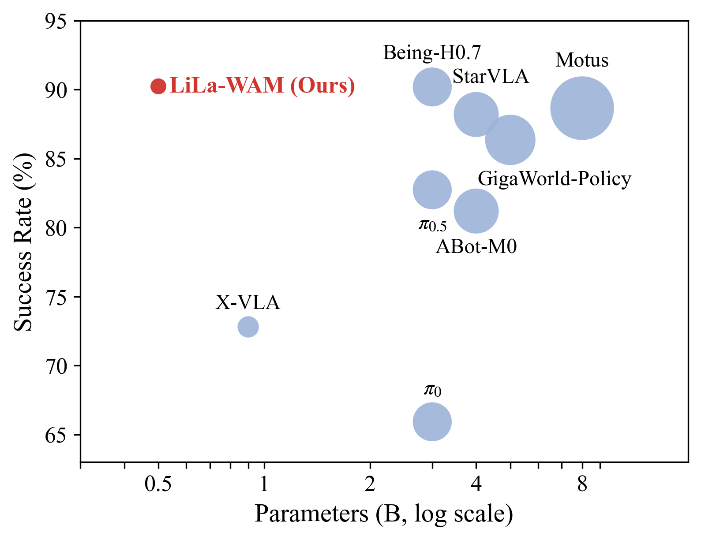
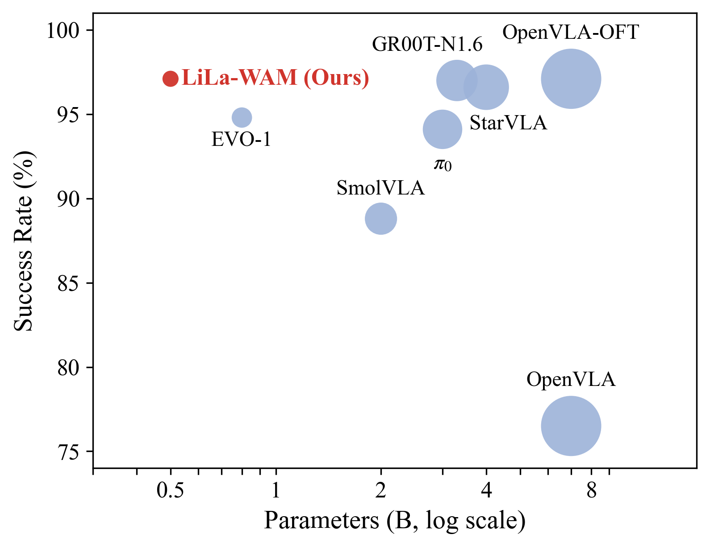
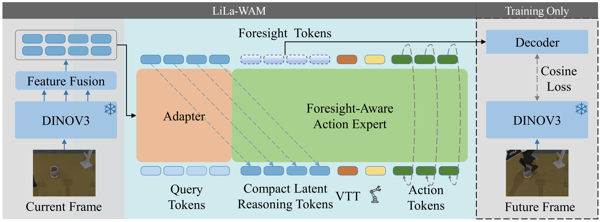

# LiLa-WAM: Lightweight Latent Reasoning World-Action Model for Robot Manipulation

Official implementation of **LiLa-WAM**, a lightweight world-action model that is trainable on a **single consumer-grade GPU (24 GB)**.

&gt; 📄 Paper: [arXiv](https://arxiv.org/pdf/2608.03701).

## Overview

LiLa-WAM achieves an average success rate of **90.48%** on the 50 RoboTwin 2.0 tasks under the clean setting, while remaining trainable on a **single RTX 5090** (~110 GPU hours for joint training on all 50 tasks). The full model contains **0.5B parameters**, of which only 0.2B are trainable.

Key features:

- 🪶 **Lightweight**: 0.5B parameters (0.2B trainable), trainable on a single 24 GB GPU
- 🔮 **World-action modeling**: latent future-state prediction coupled with action generation
- 🎯 **Visual Transition Tokens (VTT)**
- 🤖 **Evaluated on**: RoboTwin 2.0 (50 tasks), LIBERO, and real-robot experiments

<p align="center">
  
  
</p>
<p align="center">
  <em>Success rate vs. model parameters on RoboTwin 2.0 (left) and LIBERO (right).
  Bubble size denotes the number of parameters.</em>
</p>


<p align="center">
  
</p>
<p align="center">
  <em>LiLa-WAM Framework.</em>
</p>

## Installation


### Setup

1. Create and activate the conda environment:

```bash
conda create -n LiLaWAM python=3.10 -y
conda activate LiLaWAM
```

2. Install PyTorch (CUDA 12.8):

```bash
pip install torch==2.7.1 torchvision==0.22.1 --index-url https://download.pytorch.org/whl/cu128
```

3. Install other dependencies:

```bash
pip install transformers==5.0.0rc0 omegaconf accelerate h5py
```

## Preparation

Our processed RoboTwin 2.0 dataset is available on ModelScope. Search for **`LiLa-WAM_RoboTwin2.0_50_task`** on [ModelScope](https://www.modelscope.cn) to download.

&gt; **Note:** We have removed the static segments from the demonstrations generated by the official RoboTwin scripts.

LiLa-WAM uses the frozen **DINOv3 ViT-L/16** encoder:

- Model: `dinov3-vitl16-pretrain-lvd1689m`

## Configuration

Before training or evaluation, update the following paths in the configuration files under `configs/`:

| Field | Description |
|---|---|
| `dataset_dir` | Path to the training dataset |
| `task_cond_dir` | Path to the VTT embedding files |
| `model.vision_encoder.checkpoint_path` | Path to the pretrained DINOv3 checkpoint |


## Checkpoints

Checkpoints will be released soon.

## Citation

If you find this work useful, please consider citing:

```bibtex
@article{lilawam2026,
  title={LiLa-WAM: Lightweight Latent Reasoning World-Action Model for Robot Manipulation},
  journal={https://arxiv.org/pdf/2608.03701},
  year={2026}
}
```
